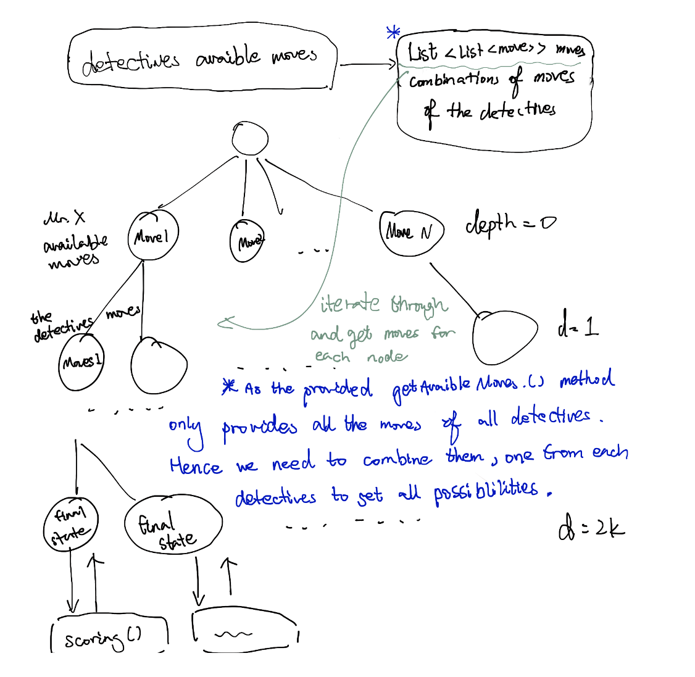

#Report on Modelling of Scotland Yard

##CW-Model

The code in CW-Model has passed all 83 tests. Most exceptional circumstances are identified with the help of the TestModule. There are 15 helper functions for methods required by the interface Board. Which will be explained later in the Implementation section.

### Implementation
#### How Available Moves Are Produced

The single moves are produced by a given player and a given ticket map. To generate a move, the function firstly iterates through the adjacent node of the location of the given player. Then it checks whether a detective has occupied the node and if the player has the required ticket. If so the move will be made by the given player, node, and required ticket, then added to the result list. Finally, the secret move will be made and added as well if the player has any secret card.

All single moves are needed to produce double moves.  An intermediate destination must be one of the destinations of available single moves. Hence the function iterates through the available single moves, finds adjacent nodes of the intermediate destination, and produces a new ticket board. Next, it iterates through the adjacent nodes, passing it and the new ticket board to the CheckSingleMove function to check its feasibility. A helper function will ingrate two single moves together to produce a double move.

#### Lamda Functions

### Reflection

Almost all of our biggest struggles in the development process come from our Improvidence. When we passed a test that has been bothering us for a long time, we suddenly found that the test we could have passed did not pass. We had to stop the development process to sort if-else and loop logics. We had to review our understanding of every attribute. 

## CW-AI

### Summary

Our AI stands on the Minimax Algorithm, which is a wildly used algorithm for turn-based games. The detective's turn is slightly handy so we use the CartesianProduct function provided by Guava to get all possible combinations of moves for their turn. The scoring function is based on Dijisktra Algorithm, which will be explained in detail later.

#### Scoring Function

The scoring function considers the distances from detectives to Mr.X. It also weighs each distance because the closer the detective is the more dangerous the game state will be. The function reviews the log entry too. The score will be higher if the detective sees a secret move when revealed. It also saves double moves for more emergency circumstances otherwise the AI is going to consume them at the very beginning of the game.

The general score is calculated by the following function
$$
S=base-\sum_{i=0}^{n} \frac{\alpha}{d_{i}^2}
$$
where *base* is the base score and *alpha* is an argument. The value of *alpha* is on the basis of the base score.  

#### Minimax and Alpha-Beta Prunning

Simulation in the minimax algorithm uses a lite version of MyGameState class we implemented in CW-Model. A new instance will be initialized for each move and passed into the deeper recursion until the recursive function reaches the base. A tree will be created in this process, and a higher node will select the biggest or smallest score from its children nodes. Scores are passed from the bottom way to the top layer of nodes. Therefore, the helper function can select the correct optimal move by comparing the score of the root node and that of its children.

### Limitation of AI

The biggest limitation of our AI is its efficiency. We have cut the unneccesary simulation and  used Alpha-Beta Prunning. Even so the workload is still huge for a low performancy laptop. 

The scoring function has another important issue. It cannot analysis the density of detectives in an area. If the four detectives are at equal distances from the suspect, but two are in the east and the rest in the other direction. The AI cannot tell that the two detectives on the east are more dangerous than the others.

### Reflection

